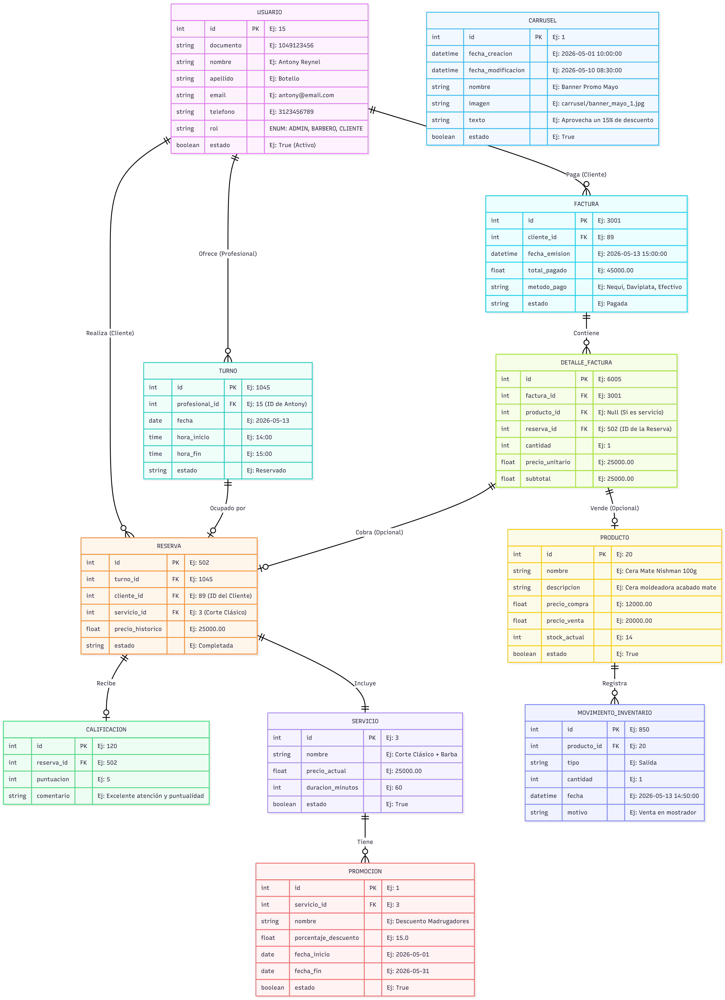

# Documentación del Sistema de Reservas y Facturación

Este proyecto está desarrollado en **Django** y sigue una arquitectura modular orientada a dominios de negocio. Esta estructura garantiza escalabilidad, fácil mantenimiento y una separación clara de responsabilidades.

## Modelo Entidad Relación (MER)

A continuación se detalla la estructura de la base de datos, optimizada para el flujo de reservas por turnos y facturación unificada:

---

## Arquitectura de Módulos (Apps de Django)

El sistema está dividido en las siguientes aplicaciones principales, respetando la regla de mantener la temática general como el módulo (carpeta) y las entidades como submódulos (modelos).

| Módulo (App Django) | Modelos (Subtemas) | Descripción de Responsabilidades |
| :--- | :--- | :--- |
| **`usuarios`** | `Usuario` | Gestión de cuentas, autenticación y control de acceso. Utiliza un campo ENUM para los roles (ADMIN, BARBERO, CLIENTE) simplificando las consultas. |
| **`servicios`** | `Servicio`, `Promocion` | Catálogo de servicios ofrecidos (con su duración en minutos) y gestión de descuentos o promociones con vigencia temporal. |
| **`reservas`** | `Turno`, `Reserva`, `Calificacion` | Motor principal de citas. Administra la disponibilidad de los profesionales por bloques de tiempo (`Turnos`), asigna las `Reservas` congelando el precio histórico y recopila el feedback de los clientes (`Calificacion`). |
| **`inventario`** | `Producto`, `MovimientoInventario` | Control de stock tipo Kardex. Administra el catálogo de artículos físicos y registra el historial detallado de entradas y salidas para auditoría. |
| **`facturacion`** | `Factura`, `DetalleFactura` | Procesamiento unificado de pagos (POS). Permite cobrar en una sola transacción tanto los servicios prestados (mediante la `Reserva`) como la venta directa de `Productos`. |
| **`configuracion`** | `Carrusel` | Administración del contenido visual dinámico del frontend, como los banners promocionales, optimizando y gestionando el ciclo de vida de las imágenes. |

---

## Notas de Implementación

*   **Autenticación:** El modelo `Usuario` debe extender de `AbstractUser` o `AbstractBaseUser` de Django, utilizando el identificador (ej. documento o email) según los requerimientos de acceso.
*   **Gestión de Inventario:** Las salidas de inventario se gestionan automáticamente mediante señales (*Signals*) de Django (`post_save`) al momento de emitir una factura que contenga productos.
*   **Limpieza de Archivos:** El módulo de configuración utiliza señales (`pre_save`, `post_delete`) para eliminar archivos multimedia huérfanos (imágenes del carrusel) y optimizar el almacenamiento del servidor.
*   **Limpieza de Archivos:** El módulo de configuración utiliza señales (`pre_save`, `post_delete`) para eliminar archivos multimedia huérfanos (imágenes del carrusel) y optimizar el almacenamiento del servidor.
